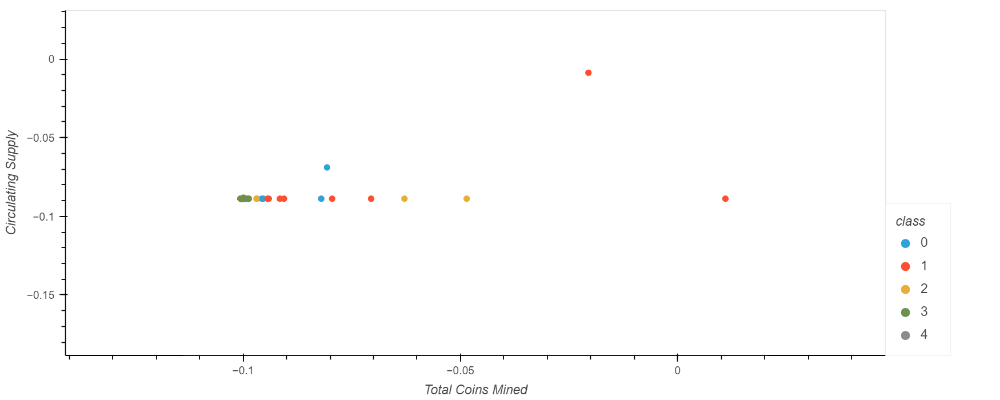

# HW13 - Option 2: Clustering Crypto

### Background

I am the Senior Manager at the Advisory Services team on a [Big Four firm](https://en.wikipedia.org/wiki/Big_Four_accounting_firms). One of my most important clients, a prominent investment bank, is interested in offering a new cryptocurrencies investment portfolio for its customers, however, they are lost in the immense universe of cryptocurrencies. They ask me to help them make sense of it all by generating a report of what cryptocurrencies are available on the trading market and how they can be grouped using classification.

I will use my unsupervivsed learning and Amazon SageMaker skills into action by clustering cryptocurrencies and creating plots to showcase my results.

Here's a summary of the process:

- **[Data Preprocessing](#Data-Preprocessing):** Prepare data for dimension reduction with PCA and clustering using K-Means.

- **[Reducing Data Dimensions Using PCA](#Reducing-Data-Dimensions-Using-PCA):** Reduce data dimension using the `PCA` algorithm from `sklearn`.

- **[Clustering Cryptocurrencies Using K-Means](#Clustering-Cryptocurrencies-Using-K-Means):** Predict clusters using the cryptocurrencies data using the `KMeans` algorithm from `sklearn`.

- **[Visualizing Results](#Visualizing-Results):** Create some plots and data tables to present results.

- **[Optional Challenge](#Optional-Challenge):** Deploy notebook to Amazon SageMaker.

---

### Files

- [Crypto Clustering](ClusteringCrypto/crypto_clustering.ipynb)

- [Crypto Clustering - Sage Maker](ClusteringCrypto/crypto_clustering_sm.ipynb)

---

### Results

The total number of tradable cryptocurrencies is **130**.

Here's a sample of the classified cryptocurrencies:

Refer to the list of tradable cryptocurrencies in the following [csv](ClusteringCrypto/tradable_cryptos.csv).
